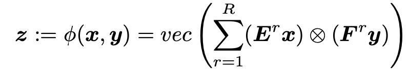

<!-- .element height="20%" width="20%" -->

__Abstract:__ 
Fine-grained action segmentation in long untrimmed videos is an important task for many applications such as surveillance, robotics, and human-computer interaction. To understand subtle and precise actions within a long time period, second-order information (e.g. feature covariance) or higher is reported to be effective in the literature. However, extracting such high-order information is considerably non-trivial. In particular, the dimensionality increases exponentially with the information order, and hence gaining more representation power also increases the computational cost and the risk of overfitting. In this paper, we propose an approach to representing high-order information for temporal action segmentation via a simple yet effective bilinear form. Specifically, our contributions are: (1) From the multilinear perspective, we derive a bilinear form of low complexity, assuming that the three-way tensor has low-rank frontal slices. (2) Rather than learning the tensor entries from data, we sample the entries from different underlying distributions, and prove that the underlying distribution influences the information order. (3) We employed our bilinear form as an intermediate layer in state-of-the-art deep neural networks, enabling to represent high-order information in complex deep models effectively and efficiently. Our experimental results demonstrate that the proposed bilinear form outperforms the previous state-of-the-art methods on the challenging temporal action segmentation task.

