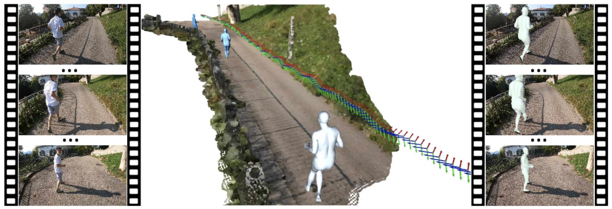

<!-- .element height="20%" width="20%" -->

__Abstract:__ 
To understand human daily social interaction from egocentric perspective, we introduce a novel task of reconstructing a time series of second-person 3D human body meshes from monocular egocentric videos. The unique viewpoint and rapid embodied camera motion of egocentric videos raise additional technical barriers for human body capture. To address those challenges, we propose a novel optimization-based approach that leverages 2D observations of the entire video sequence and human-scene interaction constraint to estimate second-person human poses, shapes and global motion that are grounded on the 3D environment captured from the egocentric view. We conduct detailed ablation studies to validate our design choice. Moreover, we compare our method with previous state-of-the-art method on human motion capture from monocular video, and show that our method estimates more accurate human-body poses and shapes under the challenging egocentric setting. In addition, we demonstrate that our approach produces more realistic human-scene interaction. 

[Project Page](https://aptx4869lm.github.io/4DEgocentricBodyCapture/)

