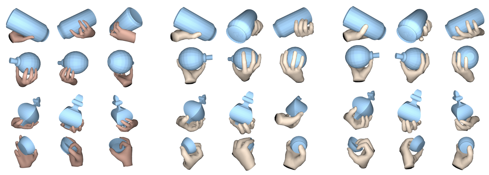

<!-- .element height="20%" width="20%" -->

__Abstract:__ 
Robotic grasping of house-hold objects has made remarkable progress in recent years. Yet, human grasps are still difficult to synthesize realistically. There are several key reasons: (1) the human hand has many degrees of freedom (more than robotic manipulators); (2) the synthesized hand should conform to the surface of the object; and (3) it should interact with the object in a semantically and physically plausible manner. To make progress in this direction, we draw inspiration from the recent progress on learning-based implicit representations for 3D object reconstruction. Specifically, we propose an expressive representation for human grasp modelling that is efficient and easy to integrate with deep neural networks. Our insight is that every point in a three-dimensional space can be characterized by the signed distances to the surface of the hand and the object, respectively. Consequently, the hand, the object, and the contact area can be represented by implicit surfaces in a common space, in which the proximity between the hand and the object can be modelled explicitly. We name this 3D to 2D mapping as Grasping Field, parameterize it with a deep neural network, and learn it from data. We demonstrate that the proposed grasping field is an effective and expressive representation for human grasp generation. Specifically, our generative model is able to synthesize high-quality human grasps, given only on a 3D object point cloud. The extensive experiments demonstrate that our generative model compares favorably with a strong baseline and approaches the level of natural human grasps. Furthermore, based on the grasping field representation, we propose a deep network for the challenging task of 3D hand-object interaction reconstruction from a single RGB image. Our method improves the physical plausibility of the hand-object contact reconstruction and achieves comparable performance for 3D hand reconstruction compared to state-of-the-art methods. Our model and code are available for research purpose at https://github.com/korrawe/grasping_field.

[Project Page](https://ps.is.mpg.de/publications/grapingfield-3dv-2020)

