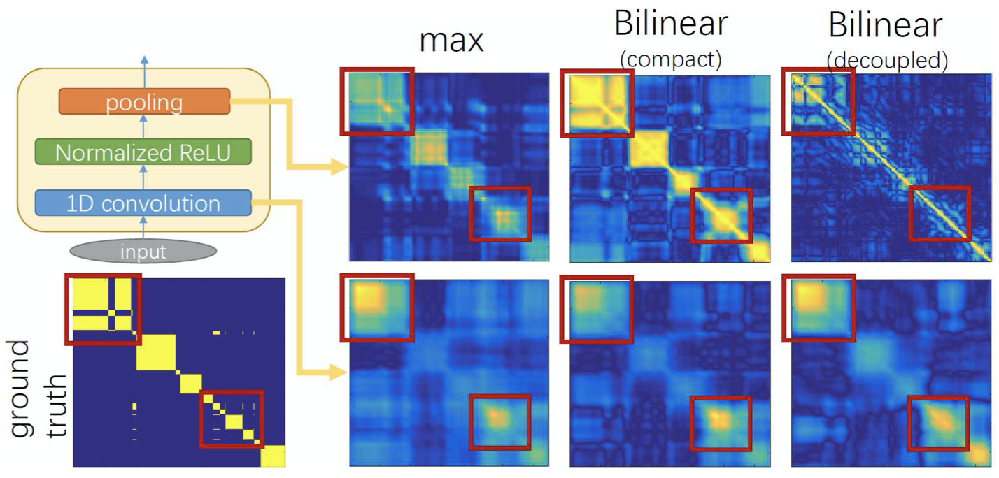

<!-- .element height="20%" width="20%" -->

__Abstract:__ 
Fine-grained temporal action parsing is important in many applications, such as daily activity understanding, human motion analysis, surgical robotics and others requir- ing subtle and precise operations over a long-term period. In this paper we propose a novel bilinear pooling operation, which is used in intermediate layers of a temporal convolutional encoder-decoder net. In contrast to previous work, our proposed bilinear pooling is learnable and hence can capture more complex local statistics than the conventional counterpart. In addition, we introduce exact lower-dimension representations of our bilinear forms, so that the dimensionality is reduced without suffering from information loss nor requiring extra computation. We perform extensive experiments to quantitatively analyze our model and show the superior performances to other state-of-the-art pooling work on various datasets.

