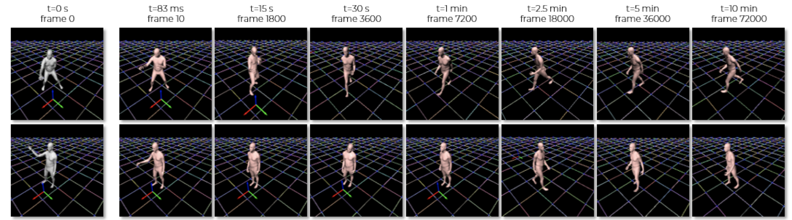

<!-- .element height="20%" width="20%" -->

__Abstract:__ 
The modeling of human motion using machine learning methods has been widely studied. In essence it is a time-series modeling problem involving predicting how a person will move in the future given how they moved in the past. Existing methods, however, typically have a short time horizon, predicting a only few frames to a few seconds of human motion. Here we focus on long-term prediction; that is, generating long sequences (potentially infinite) of human motion that is plausible. Furthermore, we do not rely on a long sequence of input motion for conditioning, but rather, can predict how someone will move from as little as a single pose. Such a model has many uses in graphics (video games and crowd animation) and vision (as a prior for human motion estimation or for dataset creation). To address this problem, we propose a model to generate non-deterministic, \textit{ever-changing}, perpetual human motion, in which the global trajectory and the body pose are cross-conditioned. We introduce a novel KL-divergence term with an implicit, unknown, prior. We train this using a heavy-tailed function of the KL divergence of a white-noise Gaussian process, allowing latent sequence temporal dependency. We perform systematic experiments to verify its effectiveness and find that it is superior to baseline methods.
