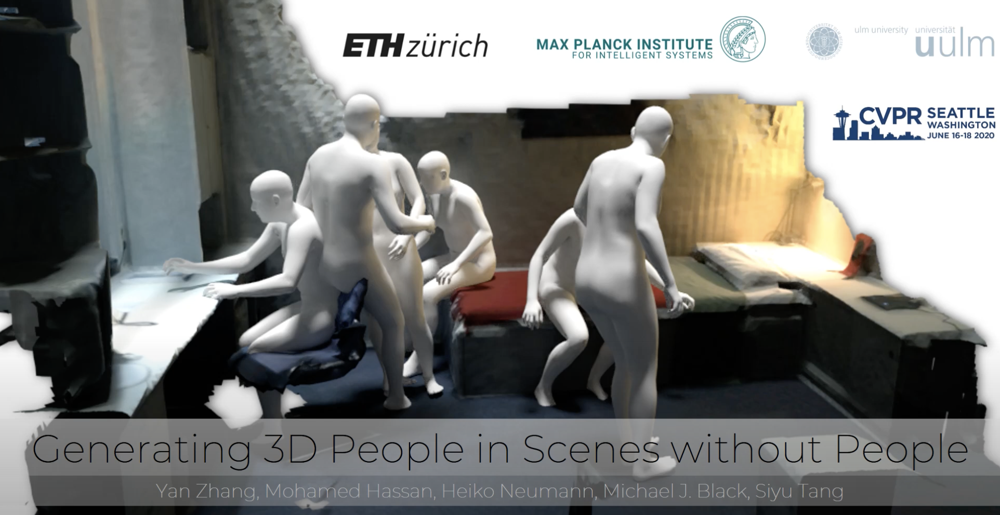

<!-- .element height="20%" width="20%" -->

__Abstract:__ 
We present a fully automatic system that takes a 3D scene and generates plausible 3D human bodies that are posed naturally in that 3D scene. Given a 3D scene without people, humans can easily imagine how people could interact with the scene and the objects in it. However, this is a challenging task for a computer as solving it requires that (1) the generated human bodies to be semantically plausible within the 3D environment (e.g. people sitting on the sofa or cooking near the stove), and (2) the generated human-scene interaction to be physically feasible such that the human body and scene do not interpenetrate while, at the same time, body-scene contact supports physical interactions. To that end, we make use of the surface-based 3D human model SMPL-X. We first train a conditional variational autoencoder to predict semantically plausible 3D human poses conditioned on latent scene representations, then we further refine the generated 3D bodies using scene constraints to enforce feasible physical interaction. We show that our approach is able to synthesize realistic and expressive 3D human bodies that naturally interact with 3D environment. We perform extensive experiments demonstrating that our generative framework compares favorably with existing methods, both qualitatively and quantitatively. We believe that our scene-conditioned 3D human generation pipeline will be useful for numerous applications; e.g. to generate training data for human pose estimation, in video games and in VR/AR. 

[Project Page](https://ps.is.mpg.de/publications/smpl-x-conditional-vae-prox-scene-constraints)

