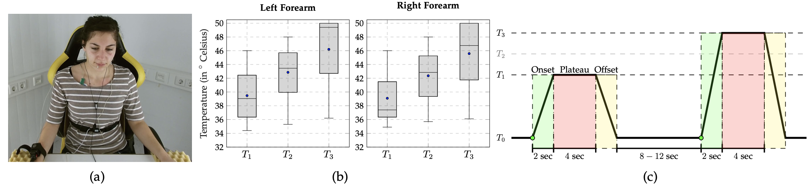

<!-- .element height="20%" width="20%" -->

__Abstract:__ 
The subjective nature of pain makes it a very challenging phenomenon to assess. Most of the current pain assessment approaches rely on an individual's ability to recognise and report an observed pain episode. However, pain perception and expression are affected by numerous factors ranging from personality traits to physical and psychological health state. Hence, several approaches have been proposed for the automatic recognition of pain intensity, based on measurable physiological and audiovisual parameters. In the current paper, an assessment of several fusion architectures for the development of a multi-modal pain intensity classification system is performed. The contribution of the presented work is two-fold: (1) 3 distinctive modalities consisting of audio, video and physiological channels are assessed and combined for the classification of several levels of pain elicitation. (2) An extensive assessment of several fusion strategies is carried out in order to design a classification architecture that improves the performance of the pain recognition system. The assessment is based on the SenseEmotion Database and experimental validation demonstrates the relevance of the multi-modal classification approach, which achieves classification rates of respectively 83.39%, 59.53% and 43.89% in a 2 -class, 3 -class and 4 -class pain intensity classification task.

